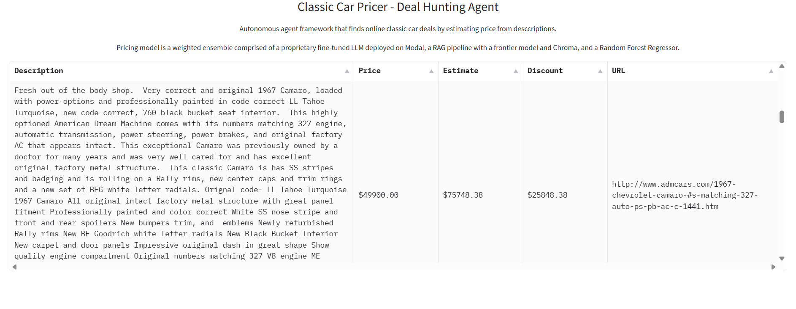

# Car Pricer
Car pricer is Car Gurus for classic cars. Car Gurus has a pricing model for modern cars. It tells you whether a particular car is priced above or below market and by how much. Their ML model is based on tabular data. Specifically, there's a depreciation schedule based on mileage, year, etc., standard option packages, and high volume (a lot of structured data).
Car Gurus does a good job wrt pricing modern cars. But classic cars is a different story (they don't do classics). The challenge is that markets are sparse and each car is unique. There's no depreciation schedule. There's some information in knowing the make, model, and year, but most of the information is contained in the description (ie. How was the engine rebuilt? How much was spent on the new paint job?... and other details of the restoration). 

**In other words, pricing modern cars is a structured data problem; pricing classic cars is an unstructured data problem.**

This project is an attempt to build a pricing model for classic cars by leveraging LLMs and other techniques to infer price from a description.

The output is in the form of a Gradio UI and iPhone push notifications.

**Gradio UI**

**iPhone Notifications**

## Key Components

### Utility Files
- **utils.py:** utility functions for loading and writing data
- **database.py:** creates db, table, and inserts data
- **items.py:** Item class creates a clean, curated datapoint of a car listing (Attrs: title, price, category, features, prompt)
- **loaders.py:** ItemLoader class uses Item class. Loads records from database, transforms them to items.
- **testing.py:** test harness used for evaluation. Takes a trained model and test set, runs inference, and outputs eval results and graph.
- **config:** config.py and config_deploy.py contain all hardcoded variables for import into the scripts where they are used.
### Scraper
- **scraper.py:** Scraper class used to gather dataset.
- **process_ids.py:** runs Scraper class on each listing id (collecting description and details), then saves records in json.
### Pricing Model
- **specialist_agent.py:** calls car-pricer service deployed on Modal through service.py
- **rag_agent.py:** fetches top_k similar cars from ChromaDB, adds them to the context for the LLM to use to price the new car description.
- **tfidf_rf_regressor.py:** TF-IDF Random Forest Regressor model that creates weights and embedding artifacts used by rf_agent.
- **rf_agent.py:** calls random forest model to price the new car description.
- **ensemble_agent.py:** uses linear regression (features are predicted prices, target is actual price) to weight the contribution of all three models' to the ensemble
### Agent Framework
- **agent.py:** Superclass for all agents used for color coded logging
- **memory.json:** memory bank of seen deals
- **screener_agent.py:** screens deals by scraping rss feed, filtering for cars that meet criteria (make, model, year), then checks memory to return only new deals not in memory.
- **messaging_agent.py:** Sends push notification when there's a qualified opportunity via Pushover API.
- **planning_agent.py:** coordinates the workflow for a deal. 1) uses ScreenerAgent to find deals; 2) EnsambleAgent to estimate; 3) MessagingAgent to notify.
- **deal_agent_framework.py:** runs planner and writes new deals to memory.
### Deployment
- **service.py:** loads "specialist" quantized 4bit OSS model finetuned on the training set from local folder and spins up Modal VM to run inference on car descriptions.
- **classic_car_pricer.py:** runs the agent workflow (via DealAgentFramework class), launches the web UI, and sends push notifications for new opportunities.
### Notebooks
Excluding the colab notebook, these notebooks were used for experimenting, testing, and building the functions that make up the final classes and scripts.
- dataset.ipynb:
- baseline_models.ipynb:
- finefune_frontier.ipynb:
- [finetune_oss](https://drive.google.com/drive/folders/1lvzq8rCwP8t8WpKIUMSWVoDY2Tt__E3r?usp=sharing): folder with OSS finetune colab notebook (needed to rent a GPU)
- deploy_testing.ipynb:
- get_deals.ipynb:
- build_ui.ipynb:

## To Do
